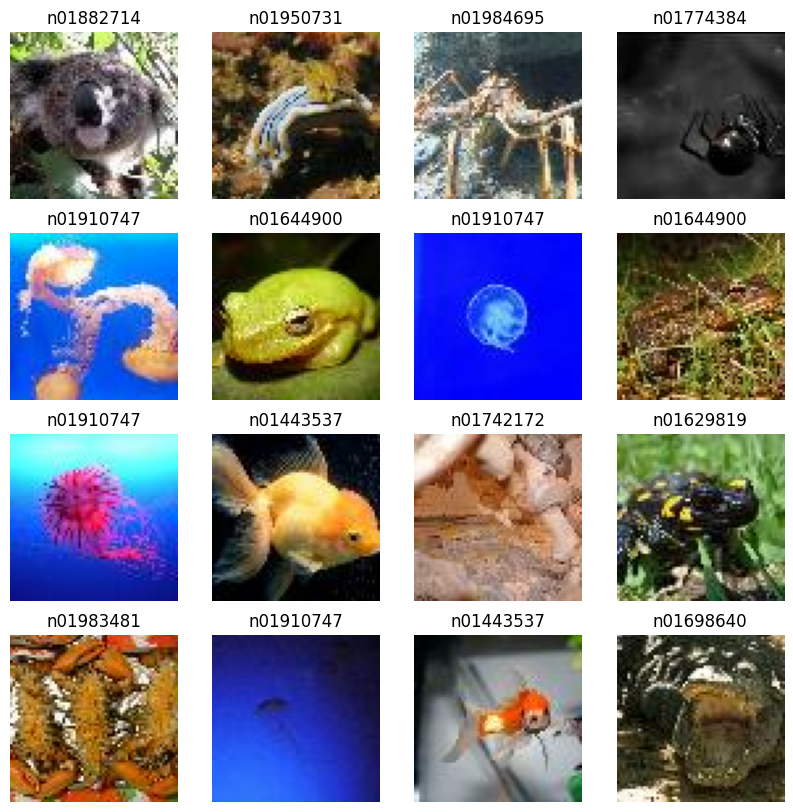

# Tiny ImageNet Classification using a Custom CNN Model

This project implements a CNN model inspired by AlexNet to classify images from the Tiny ImageNet dataset. Given the computational constraints, the model was built with a simplified architecture using TensorFlow and Keras.

## Dataset

The Tiny ImageNet dataset was sourced from [Kaggle](https://www.kaggle.com/datasets/umangjjw/tinyimagenet200/data). However, the data organization in the provided format was incompatible with TensorFlow's dataset loading API, so the folder structure was modified.

### Dataset Structure

The dataset structure was changed from:

```
- tiny-imagenet-200
  - train
    - label_1
      - image_1
      - image_2
    - label_2
      - image_1
      - image_2
```

to:

```
- train_images
  - label_1
    - image_1
    - image_2
  - label_2
    - image_1
    - image_2
```

Only 20 classes were retained, corresponding to 20 sub-folders, reducing the dataset complexity.

## Installation

The following Python libraries are required:

```python
import numpy as np
import os
import tensorflow as tf
import pathlib
import shutil
import matplotlib.pyplot as plt
```

## Data Loading and Preprocessing

1. **Loading Dataset**: The dataset was loaded using the TensorFlow dataset API with a batch size of 16 and image shape of 64x64.
2. **Data Preprocessing**:
   - Images were resized to (64, 64) and normalized by dividing by 255 to improve computation efficiency.
   - The dataset was processed through the following pipeline:
     ```plaintext
     dataset -> map(function_resize_rescale) -> cache() -> prefetch()
     ```

## Data Visualization

Random samples from each label are displayed using `matplotlib` for initial visual analysis.



## Model Architecture

Given computational limitations, a simplified version of the AlexNet architecture was designed. The model architecture includes the following layers:

1. **Conv2D (32 filters, 3x3)** + ReLU
2. **Local Response Normalization**
3. **MaxPooling (2x2)**
4. **Conv2D (64 filters, 3x3)** + ReLU
5. **Local Response Normalization**
6. **MaxPooling (2x2)**
7. **Conv2D (128 filters, 3x3)** + ReLU
8. **Conv2D (128 filters, 3x3)** + ReLU
9. **Conv2D (64 filters, 3x3)** + ReLU
10. **MaxPooling (2x2)**
11. **Flatten**
12. **Dense (1024 units)** + ReLU + Dropout
13. **Dense (512 units)** + ReLU + Dropout
14. **Dense (20 units)** + Softmax

## Model Compilation

The model was compiled with the following configurations:

- **Optimizer**: SGD (Stochastic Gradient Descent)
- **Loss Function**: Sparse Categorical Crossentropy
- **Metric**: Accuracy

## Training

The model was trained for 35 epochs with TensorBoard as a callback for monitoring training progress, tracking how loss decreased and accuracy increased with each epoch.

Epoch Accuracy


Epoch Loss


Model is overfitting

## Model Saving

The trained model is saved as `"ALEX_NET_MINI2.h5"`.

## Evaluation

The model was evaluated on test images, comparing actual labels (`R`) with predicted labels (`P`).


The model has an accurace of 0.43.
Which is low, It can be improved with data augumentation , playing around with the batch size to reduce over fitting and improve the robustness of the model.
